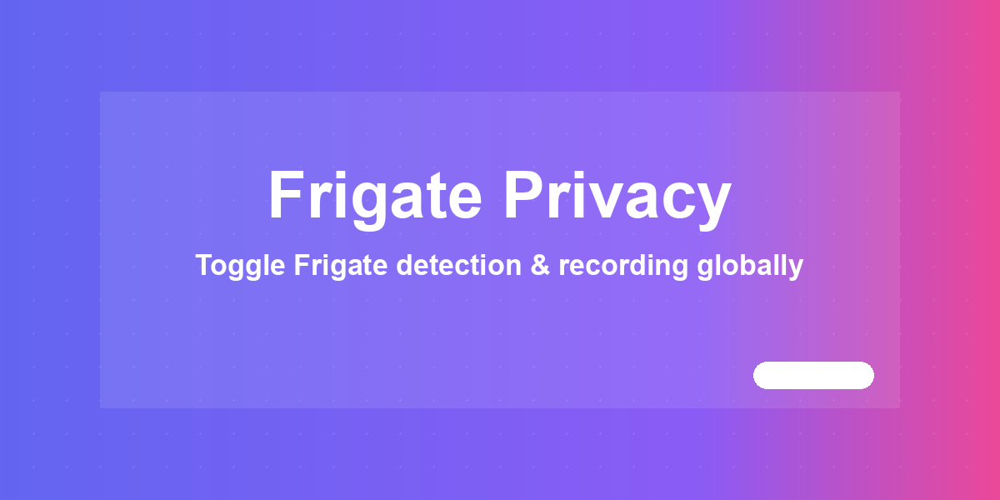
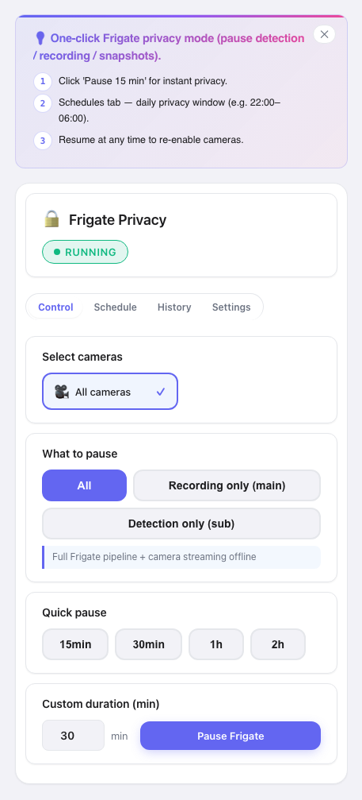

# Frigate Privacy



Pause and resume Frigate camera detection and recordings on a schedule or on demand —
for household privacy moments, guests, or work-from-home hours. Ships as a Home
Assistant integration with a bundled Lovelace card, server-side privacy schedules,
fail-safe resume handling, and per-camera binary sensors for automations.

[](https://www.home-assistant.io/) [](LICENSE) [](https://github.com/MacSiem/ha-frigate-privacy/releases)

## How it works

**Short version: it works automatically.** After you install the integration and add
the card, your Frigate cameras are discovered and ready to pause — no YAML.

1. **Auto-discovery.** The integration finds Frigate cameras from the
   `switch.<cam>_detect` / `switch.<cam>_recordings` entities the Frigate
   integration already creates. Works across Frigate versions (0.14–0.17+).
2. **Pause / resume.** Pausing turns the relevant Frigate switches off (detection,
   recordings, or all — your choice); resuming turns them back on. An optional
   duration (1 min – 24 h) auto-resumes the camera.
3. **Privacy schedules.** Create recurring windows (e.g. weekday mornings) during
   which selected cameras pause automatically. Schedules are stored server-side
   (HA Store, included in backups) and survive restarts.
4. **Fail-safe resume.** Resume decisions are guarded: missing or unavailable
   switches block auto-resume before anything is toggled, and service failures
   never silently clear a privacy window — a camera never ends up in a wrong state.
5. **Entities for automations.** Each camera gets
   `binary_sensor.<camera>_privacy_active` reflecting its privacy state, so you can
   drive lights, notifications or dashboards from it.

### What is automatic vs. manual

| Automatic | Manual (optional) |
|---|---|
| Discovering Frigate cameras | Pressing pause / resume in the card |
| Auto-resume after a timed pause | Creating privacy schedules |
| Fail-safe checks before resume | Choosing stream type (detect/record/all) |
| Per-camera `*_privacy_active` sensor | — |

> **Non-admin users:** since v5.0.4 the card renders for every logged-in user.
> Pausing/resuming and editing schedules remain admin-only on purpose — disabling
> camera recording is a privileged, security-relevant action.

## Screenshot



## Installation

1. Open HACS → Custom repositories.
2. Add `https://github.com/MacSiem/ha-frigate-privacy` as category **Integration**.
3. Install **Frigate Privacy** and restart Home Assistant.
4. Go to Settings → Devices & services → Add integration → **Frigate Privacy**.

The integration registers the bundled Lovelace card automatically — no manual
resource needed.

## Quick start

```yaml
type: custom:ha-frigate-privacy
```

That's it. The card lists every discovered Frigate camera with pause/resume buttons,
timers and the schedule editor.

## Entities for automations

| Entity | Meaning |
|---|---|
| `binary_sensor.<camera>_privacy_active` | `on` while the camera is privacy-paused |

**Example — light up an indicator while a camera is paused:**

```yaml
alias: Privacy indicator
trigger:
  - platform: state
    entity_id: binary_sensor.living_room_privacy_active
    to: "on"
action:
  - service: light.turn_on
    target: { entity_id: light.privacy_indicator }
mode: single
```

## FAQ

**Do I have to configure anything?**
No. Install → add integration → add card. Cameras are discovered from Frigate's own
switches.

**Which Frigate versions are supported?**
0.14 – 0.17+. The integration tracks switch-entity renames across versions
(e.g. 0.17 removed `_enabled` and renamed `_audio`).

**What happens if something fails during resume?**
The fail-safe logic refuses to clear a privacy window when switches are missing,
unavailable, or a service call fails — so state stays consistent.

**Can guests (non-admin users) pause cameras?**
No — by design. They can see the card (view-only); pausing requires an admin account.

**Does this send data anywhere?**
No. No telemetry, no CDN assets. Schedules and state are stored locally by Home
Assistant and included in backups.

## Changelog

See [CHANGELOG.md](CHANGELOG.md).

## Support

- [Buy Me a Coffee](https://buymeacoffee.com/macsiem)
- [PayPal](https://www.paypal.com/donate/?hosted_button_id=Y967H4PLRBN8W)

## License

MIT, see [LICENSE](LICENSE).
