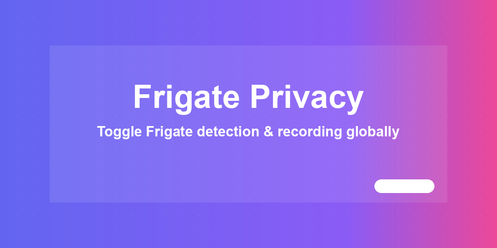
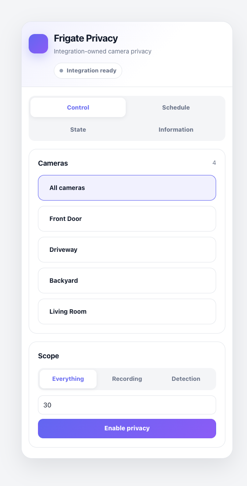
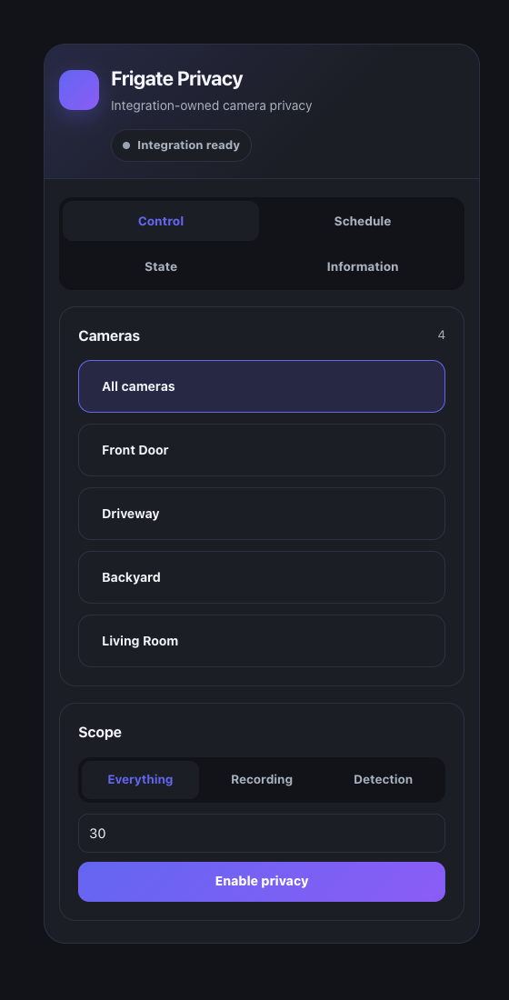

# Frigate Privacy



Pause and resume Frigate camera detection and recordings on a schedule or on demand.
The Home Assistant integration is the only control authority: the bundled card sends
admin-only WebSocket requests, while schedules, deadlines, state transitions, and
restart recovery stay server-side.

[](https://www.home-assistant.io/) [](LICENSE) [](https://github.com/MacSiem/ha-frigate-privacy/releases)

## How it works

After you install the integration and add the card, Frigate cameras are discovered
from existing Home Assistant entities. No YAML helper or browser automation is
created.

1. **Auto-discovery.** The integration finds Frigate cameras from the
   `switch.<cam>_detect` / `switch.<cam>_recordings` entities the Frigate
   integration already creates, and verifies every target against Home
   Assistant's Entity Registry (`platform: frigate`) before control.
2. **Pause / resume.** Pausing records its intent first, turns off only the selected
   scope, and verifies the reported state. Resume re-enables only targets that this
   integration successfully changed; pre-existing manual-off targets remain off.
3. **Privacy schedules.** Create recurring windows (e.g. weekday mornings) during
   which all currently discovered Frigate cameras pause automatically. Overlapping
   windows are treated as union coverage, so privacy remains active until the last
   window ends. Schedules are stored server-side (HA Store, included in backups)
   and survive restarts.
4. **Truthful fail-safe state.** The persisted state machine uses
   `pausing`, `paused`, `resuming`, `partial`, `error`, and verified terminal
   `active`. Missing/unavailable
   targets, service failures, or readback mismatches never become a false success.
   Uncertain state stays visible for an administrator to review and retry safely.
   If a managed target is re-enabled outside the integration, that change is treated
   as evidence of a manual override—not permission to enable any other target. The
   record becomes terminal and the card stops claiming privacy is enforced.
5. **Entities for automations.** Each camera gets
   `binary_sensor.<camera>_privacy_active` reflecting its privacy state, so you can
   drive lights, notifications or dashboards from it.

### What is automatic vs. manual

| Automatic | Manual (optional) |
|---|---|
| Discovering Frigate cameras | Pressing pause / resume in the card |
| Auto-resume after a timed pause | Creating privacy schedules |
| Fail-safe checks before resume | Choosing stream type (`all` / `main` / `sub`) |
| Per-camera `*_privacy_active` sensor | — |

> **Administrator-only:** camera topology, privacy windows, and paused-state evidence
> can reveal household routines. All custom WebSocket commands, including reads,
> therefore require a Home Assistant administrator account.

### Security and privacy boundaries

- The card never reads a Home Assistant token, calls configuration REST endpoints,
  creates helpers/automations, or calls camera/switch/services directly.
- The card has no compatibility control mode. If the integration is unavailable,
  every mutating control is removed and setup guidance is shown.
- The backend accepts only currently discovered cameras for a new pause. Requests do
  not construct arbitrary entity targets, and persisted resume targets are checked
  against the Frigate Entity Registry allowlist before any side effect.
- Startup recovery waits briefly for late Frigate entities without rewriting the
  saved exact-target plan. Permanently missing targets become an explicit per-camera
  error with evidence; they do not block healthy cameras indefinitely.
- Pause, resume, and schedule mutations support bounded idempotency keys. Delayed
  retries from an older camera generation cannot undo a newer privacy decision.
  Corrupt or saturated replay protection blocks new mutations before side effects;
  the admin card reports a stable, non-sensitive reason instead of silently resetting
  protection.
- Schedules and transition evidence are stored locally in Home Assistant Store. The
  Store uses private atomic writes, and a write is not treated as successful when
  Home Assistant reports a serialization or filesystem failure. The
  browser keeps only harmless presentation preferences such as selected duration,
  stream scope, and dismissal of the introduction.
- Detailed household timing, entity topology, operation IDs and per-target evidence
  are returned only by the admin-gated integration API. The automation-facing binary
  sensor exposes a deliberately reduced state summary.
- No telemetry is sent. Support links are ordinary external links and open only when
  selected by the user.

## Screenshots

| Light | Dark |
|---|---|
|  |  |

*Synthetic, privacy-safe fixtures show the current Control tab: discovered cameras,
pause scope and duration. Dark mode follows your Home Assistant theme automatically.*

## Installation

1. Open HACS → Custom repositories.
2. Add `https://github.com/MacSiem/ha-frigate-privacy` as category **Integration**.
3. Install **Frigate Privacy** and restart Home Assistant.
4. Go to Settings → Devices & services → Add integration → **Frigate Privacy**.

The integration registers the bundled Lovelace card automatically — no manual
resource needed.

## Quick start

```yaml
type: custom:ha-frigate-privacy
```

That's it. For an administrator, the card lists discovered Frigate cameras with
pause/resume controls, backend-confirmed state, and the schedule editor.

## Entities for automations

| Entity | Meaning |
|---|---|
| `binary_sensor.<camera>_privacy_active` | `on` while the camera is privacy-paused |

**Example — light up an indicator while a camera is paused:**

```yaml
alias: Privacy indicator
trigger:
  - platform: state
    entity_id: binary_sensor.living_room_privacy_active
    to: "on"
action:
  - service: light.turn_on
    target: { entity_id: light.privacy_indicator }
mode: single
```

## FAQ

**Do I have to configure anything?**
No. Install → add integration → add card. Cameras are discovered from Frigate's own
switches.

**Which Frigate entities are recognized?**
Camera discovery uses the `_detect` and `_recordings` switches. The control layer
also recognizes current and legacy recording, snapshot, motion, audio, and review
switch suffixes when those entities exist.

**What happens if something fails during resume?**
The integration keeps the persisted record in `partial` or `error`, attempts to
restore any target that was re-enabled during a failed resume, and creates a
best-effort persistent notification. It does not claim the camera is active until
the changed targets pass readback. Task cancellation follows the same privacy-first
path: compensation and evidence persistence finish before cancellation propagates.

**What happens if I manually re-enable a Frigate target during privacy mode?**
The integration marks the pause as a terminal manual override and performs no
additional camera or switch control. For a schedule, the same active coverage is not
immediately re-applied; a later schedule occurrence can start a fresh pause.

**Can guests (non-admin users) view or control the card?**
No. The card explains the permission boundary without requesting camera topology or
schedule data.

**Does this send data anywhere?**
No telemetry is implemented. Schedules and state are stored locally by Home
Assistant and included in Home Assistant backups.

## Changelog

See [CHANGELOG.md](CHANGELOG.md).

## Support

- [Buy Me a Coffee](https://buymeacoffee.com/macsiem)
- [PayPal](https://www.paypal.com/donate/?hosted_button_id=Y967H4PLRBN8W)

## License

MIT, see [LICENSE](LICENSE).
