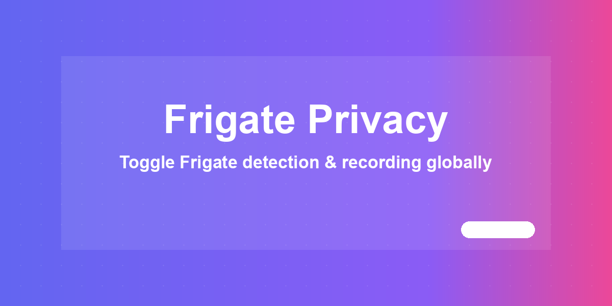
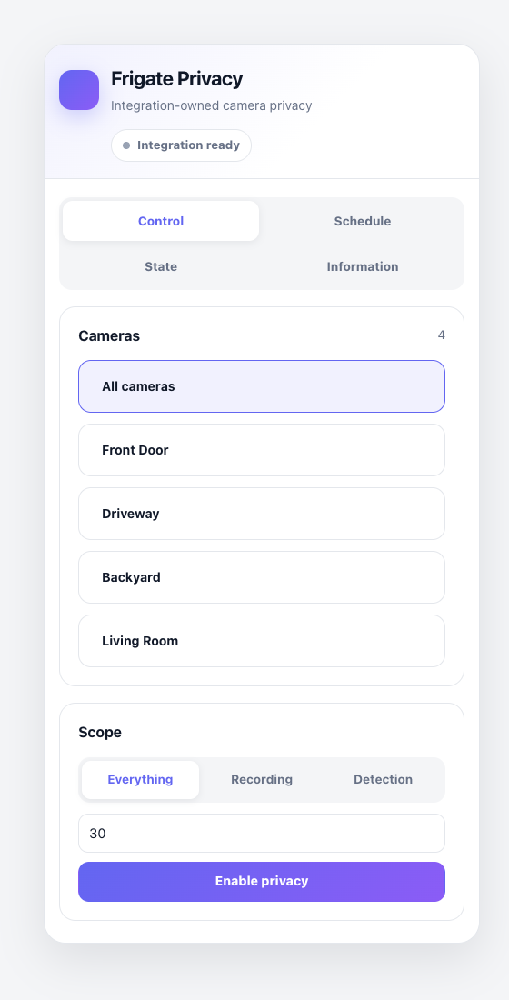
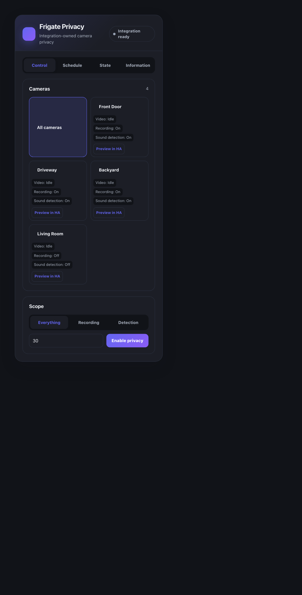

# Frigate Privacy



Pause and resume Frigate camera detection and recordings on a schedule or on demand.
The Home Assistant integration is the only control authority: the bundled card sends
admin-only WebSocket requests, while schedules, deadlines, state transitions, and
restart recovery stay server-side.

[](https://www.home-assistant.io/) [](LICENSE) [](https://github.com/MacSiem/ha-frigate-privacy/releases)

## How it works

After you install the integration and add the card, Frigate cameras are discovered
from existing Home Assistant entities. No YAML helper or browser automation is
created.

1. **Auto-discovery.** The integration finds Frigate cameras from the
   `switch.<cam>_detect` / `switch.<cam>_recordings` entities the Frigate
   integration already creates, and verifies every target against Home
   Assistant's Entity Registry (`platform: frigate`) before control.
2. **Pause / resume.** Pausing records its intent first, turns off only the selected
   scope, and verifies the reported state. Resume re-enables only targets that this
   integration successfully changed; pre-existing manual-off targets remain off.
   In the **Everything** scope, Frigate's camera entity is also stopped and
   resumed. Frigate reports an off camera as `idle` with no supported features,
   but its HA `camera.turn_on` action still works; the integration verifies the
   resulting `streaming` state before claiming that resume succeeded.
3. **Privacy schedules.** Create recurring windows (e.g. weekday mornings) during
   which all currently discovered Frigate cameras pause automatically. Overlapping
   windows are treated as union coverage, so privacy remains active until the last
   window ends. Schedules are stored server-side (HA Store, included in backups)
   and survive restarts.
4. **Truthful fail-safe state.** The persisted state machine uses
   `pausing`, `paused`, `resuming`, `partial`, `error`, and verified terminal
   `active`. Missing/unavailable
   targets, service failures, or readback mismatches never become a false success.
   Uncertain state stays visible for an administrator to review and retry safely.
   If a managed target is re-enabled outside the integration, that change is treated
   as evidence of a manual override—not permission to enable any other target. The
   record becomes terminal and the card stops claiming privacy is enforced.
5. **Entities for automations.** Each camera gets
   `binary_sensor.<camera>_privacy_active` indicating an active privacy transition
   record. Check its `phase` attribute before using it as a pause indicator;
   `on` alone does not confirm that every target is off.

### What is automatic vs. manual

| Automatic | Manual (optional) |
|---|---|
| Discovering Frigate cameras | Pressing pause / resume in the card |
| Auto-resume after a timed pause | Creating privacy schedules |
| Fail-safe checks before resume | Choosing privacy scope (`all` / `main` / `sub`) |
| Per-camera `*_privacy_active` sensor | — |

> **Administrator-only:** camera topology, privacy windows, and paused-state evidence
> can reveal household routines. All custom WebSocket commands, including reads,
> therefore require a Home Assistant administrator account.

### Privacy scopes

| Scope | Targets requested off |
|---|---|
| Everything (`all`) | Camera, when controllable, and recognized Frigate switches |
| Recording (`main`) | Recording and snapshot switches |
| Detection (`sub`) | Detection, motion and audio switches |

Recording and Detection leave the other channels running. A camera without
working HA turn-on/turn-off actions can keep streaming in Everything scope;
check the video and per-target evidence rather than assuming the live feed is off.

### Channel indicators and preview

The card shows video, recording, snapshots, detection, and sound detection
separately, including unknown and unavailable states. Sound detection does not
confirm microphone capture or listening. **Preview** opens Home Assistant's native
camera dialog on demand; this integration never automatically fetches frames or audio.

### Notifications, buttons, automations and scenes

Open Settings → Devices & services → Frigate Privacy → Configure to select a
notification destination and events: errors/partial privacy, confirmed selected-scope
pause, and verified restoration. Extra notifications default to off. Messages contain
no camera names, addresses, images or schedule details. Notification delivery failures
do not change camera control. Existing local fail-safe alerts remain enabled.

In the card's **Buttons and automations** tab, select cameras, scope and duration,
then copy an example for a dashboard button, script or automation action. For a
physical button, choose its device/event trigger in HA's automation editor and use
that action. To connect a scene, create the indicated boolean helper and the scene
bridge automation, then set the helper on/off in your HA scenes.

Administrator dashboard actions work directly. For a system-triggered automation
or script, explicitly select its entity under **Trusted automations and scripts**
in the integration options. Review its triggers and actions first: this delegates
privacy control to that action. Only its real running HA context is accepted;
a matching state name or parent context is insufficient. Revoking trust applies to
the next action. Direct household-user calls remain denied. The card provides examples
and opens HA editors; it does not silently create helpers or automations.

### Security and privacy boundaries

- The card never reads a Home Assistant token, calls configuration REST endpoints,
  creates helpers/automations, or calls camera/switch/services directly.
- The card has no compatibility control mode. If the integration is unavailable,
  every mutating control is removed and setup guidance is shown.
- The backend accepts only currently discovered cameras for a new pause. Requests do
  not construct arbitrary entity targets, and persisted resume targets are checked
  against the Frigate Entity Registry allowlist before any side effect.
- Startup recovery waits briefly for late Frigate entities without rewriting the
  saved exact-target plan. Permanently missing targets become an explicit per-camera
  error with evidence; they do not block healthy cameras indefinitely.
- Pause, resume, and schedule mutations support bounded idempotency keys. Delayed
  retries from an older camera generation cannot undo a newer privacy decision.
  Corrupt or saturated replay protection blocks new mutations before side effects;
  the admin card reports a stable, non-sensitive reason instead of silently resetting
  protection.
- Schedules and transition evidence are stored locally in Home Assistant Store. The
  Store uses private atomic writes, and a write is not treated as successful when
  Home Assistant reports a serialization or filesystem failure. The
  browser keeps only harmless presentation preferences such as selected duration,
  stream scope, and dismissal of the introduction.
- Detailed household timing, entity topology, operation IDs and per-target evidence
  are returned only by the admin-gated integration API. The automation-facing binary
  sensor exposes a deliberately reduced state summary.
- No telemetry is sent. Support links are ordinary external links and open only when
  selected by the user.

## Screenshots

| Light | Dark |
|---|---|
|  |  |

*Synthetic, privacy-safe fixtures show the current Control tab: discovered cameras,
pause scope and duration. Dark mode follows your Home Assistant theme automatically.*

## Installation

First install and configure the Frigate integration so its cameras and switches
are available in Home Assistant. Frigate Privacy controls those existing entities.

1. Open HACS → Custom repositories.
2. Add `https://github.com/MacSiem/ha-frigate-privacy` as category **Integration**.
3. Install **Frigate Privacy** and restart Home Assistant.
4. Go to Settings → Devices & services → Add integration → **Frigate Privacy**.
5. Administrators can open **Frigate Privacy** from the sidebar, or add the card below.

The integration registers one bundled Lovelace resource in storage mode; an
existing HACS card resource is preserved. YAML mode uses Home Assistant's
frontend fallback. No manual resource is needed.

The one-line support link is visible only to administrators. Set
`show_support: false` in the card configuration to hide it; dismissing it is
remembered in this browser.

## Quick start

```yaml
type: custom:ha-frigate-privacy
```

That's it. For an administrator, the card lists discovered Frigate cameras with
pause/resume controls, backend-confirmed state, and the schedule editor. Each
camera shows the current HA camera entity, recording switch, and sound-detection
switch status. **Preview in HA** opens Home Assistant's native camera view only
when selected; the card never loads a live feed on its own. An unavailable
sound-detection switch is shown as unavailable rather than assumed to be on.

## Entities for automations

| Entity | Meaning |
|---|---|
| `binary_sensor.<camera>_privacy_active` | `on` while a privacy transition record is active, including `pausing`, `paused`, `resuming`, `partial` and `error` |

The `phase` attribute distinguishes a confirmed selected-scope pause from a
pending or failed transition. Even `paused` does not guarantee that an unsupported
camera stopped streaming. Use the card's video status and target evidence too.

**Example — indicate a confirmed selected-scope pause:**

```yaml
alias: Privacy indicator
trigger:
  - platform: state
    entity_id: binary_sensor.living_room_privacy_active
    attribute: phase
    to: "paused"
condition:
  - condition: state
    entity_id: binary_sensor.living_room_privacy_active
    state: "on"
action:
  - service: light.turn_on
    target: { entity_id: light.privacy_indicator }
mode: single
```

## FAQ

**Do I have to configure anything?**
Configure Frigate in Home Assistant first. Then install → add Frigate Privacy
integration → open its sidebar or add the card. Cameras are discovered from
Frigate's own switches; no extra Frigate Privacy YAML is needed.

**Which Frigate entities are recognized?**
Camera discovery uses the `_detect` and `_recordings` switches. The control layer
also recognizes current and legacy recording, snapshot, motion, audio, and review
switch suffixes when those entities exist.

**What happens if something fails during resume?**
The integration keeps the persisted record in `partial` or `error`, attempts to
restore any target that was re-enabled during a failed resume, and creates a
best-effort persistent notification. It does not claim the camera is active until
the changed targets pass readback. Task cancellation follows the same privacy-first
path: compensation and evidence persistence finish before cancellation propagates.

**What happens if I manually re-enable a Frigate target during privacy mode?**
The integration marks the pause as a terminal manual override and performs no
additional camera or switch control. For a schedule, the same active coverage is not
immediately re-applied; a later schedule occurrence can start a fresh pause.

**Can guests (non-admin users) view or control the card?**
No. The card explains the permission boundary without requesting camera topology or
schedule data.

**Does this send data anywhere?**
No telemetry is implemented. Schedules and state are stored locally by Home
Assistant and included in Home Assistant backups.

## Changelog

See [CHANGELOG.md](CHANGELOG.md).

## Support

- [Buy Me a Coffee](https://buymeacoffee.com/macsiem)
- [PayPal](https://www.paypal.com/donate/?hosted_button_id=Y967H4PLRBN8W)

## License

MIT, see [LICENSE](LICENSE).
